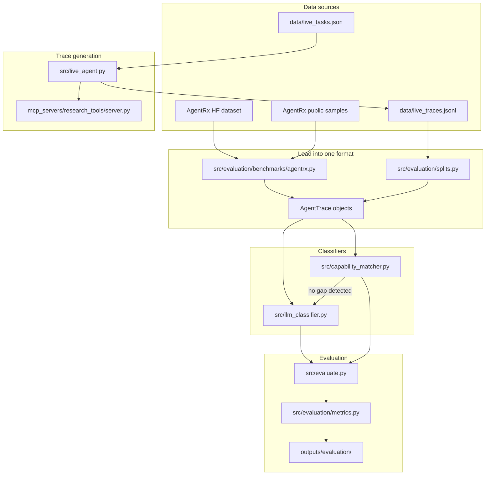

# Project Knowledge Guide (start here if you are new)

This document explains **everything** about this repository from scratch.

You do **not** need to be an AI expert. If you can run Python commands and read
JSON files, you can follow this guide.

For a shorter research-oriented overview, see [README.md](README.md).  
**This file is the full walkthrough.**

---

## Table of contents

1. [What problem are we solving?](#1-what-problem-are-we-solving)
2. [Key words (glossary)](#2-key-words-glossary)
3. [Big picture: how the project fits together](#3-big-picture-how-the-project-fits-together)
4. [What is done vs what is still TODO](#4-what-is-done-vs-what-is-still-todo)
5. [Setup from zero](#5-setup-from-zero)
6. [Datasets (what they are and where they live)](#6-datasets-what-they-are-and-where-they-live)
7. [The failure labels (F0–F8)](#7-the-failure-labels-f0f8)
8. [The two methods we compare](#8-the-two-methods-we-compare)
9. [How evaluation works](#9-how-evaluation-works)
10. [Every file and folder explained](#10-every-file-and-folder-explained)
11. [Step-by-step workflows](#11-step-by-step-workflows)
12. [What you should do next (action checklist)](#12-what-you-should-do-next-action-checklist)
13. [Command cheat sheet](#13-command-cheat-sheet)
14. [FAQ and troubleshooting](#14-faq-and-troubleshooting)

---

## 1. What problem are we solving?

Imagine an AI assistant that can call tools (search the web, read files, send
email, etc.). Sometimes the user asks for something and the agent **fails**.

Failures can happen for many reasons:

- The agent picked the wrong tool
- The agent passed bad arguments
- The tool crashed
- The user did not give enough information
- **The agent simply does not have a tool for what the user asked**

That last case is a **capability gap**. Example: user asks for weather in Berlin,
but no weather tool exists in the agent's tool list.

### What this project does

1. **Reads an agent execution trace** (what the user asked, which tools were
   available, what the agent tried, what happened).
2. **Classifies why the agent failed** using labels F0–F8.
3. **If it is a capability gap (F6)**, it also outputs a **capability request** —
   a structured description of the missing tool that *would* fix the problem.

### Why this matters (research angle)

Microsoft's **AgentRx** paper (2026) is our reference baseline. AgentRx diagnoses
failures from trajectories but **stops at the label**. It does not tell you what
tool to build.

Our contribution: detect capability gaps **and** emit the missing capability spec
— a step toward self-extending agents that can request new tools.

---

## 2. Key words (glossary)

| Term | Plain English |
|------|---------------|
| **Agent** | An LLM that can decide to call tools to complete a task |
| **Tool** | A function the agent can call (e.g. `calculator`, `send_email`) |
| **MCP** | Model Context Protocol — a standard way to expose tools to an agent |
| **Trace** | A recorded run: user task + available tools + tool calls + final answer |
| **Capability** | An abstract ability (e.g. `weather_lookup`), which may map to one or more tools |
| **Capability gap (F6)** | The task needs a capability that no available tool provides |
| **Capability request** | JSON spec describing the missing tool we wish existed |
| **Gold label** | The correct answer (human or experiment design) for evaluation |
| **Baseline** | The simple method we compare against (`llm-fair`) |
| **Our method** | The capability matcher (`capmatch-fair`) |
| **AgentRx** | External benchmark paper + dataset of real failed agent trajectories |
| **τ-bench / tau_retail** | A retail customer-service tool-calling benchmark (part of AgentRx) |

---

## 3. Big picture: how the project fits together



**In one sentence:** load traces → run a classifier → compare predictions to gold
labels → write metrics.

---

## 4. What is done vs what is still TODO

### Already implemented (you can run this today)

| Piece | Status |
|-------|--------|
| Data schemas (`AgentTrace`, `Prediction`, etc.) | Done |
| Failure taxonomy F0–F8 | Done |
| LLM baseline (`llm-fair`, `llm-oracle`) | Done |
| Capability matcher (`capmatch-fair`, `capmatch-oracle`) | Done (code) |
| Evaluation runner + metrics | Done |
| Live MCP trace generator | Done |
| AgentRx loader for **tau_retail** (29 failures) | Done |
| AgentRx public samples (7 files, offline demo) | Done |
| Capability vocabulary for cross-dataset alignment | Done |
| One baseline eval run on tau_retail | Done (partial) |

### Not finished yet (this is where research work remains)

| Gap | Why it matters |
|-----|----------------|
| **`capmatch-fair` never evaluated end-to-end** | No saved comparison vs baseline yet |
| **Stale summary file** | `outputs/evaluation/summary_all_agentrx.json` still mentions old `heuristic-fair` |
| **Live dataset is tiny** | Only 5 tasks × 2 modes = 10 traces |
| **2 live gap tasks are weak** | Translate + percent-calc: agent answers from its own knowledge instead of admitting a gap |
| **Magentic-One (44 traces)** | Gold labels load, but tool calls are not parsed correctly yet |
| **MCP-Atlas benchmark** | Adapter exists, dataset not downloaded, not run |
| **τ-bench policy gaps** | Some "gaps" are policy blocks, not missing tools — matcher does not handle this yet |
| **Automated tests** | None |

**Honest project stage:** the **prototype is built**; the **experiments are not complete**.

---

## 5. Setup from zero

### 5.1 Prerequisites

- [uv](https://docs.astral.sh/uv/) (manages the Python version and dependencies — no
  manual venv needed)
- `git clone` of this repo
- A **TUD:AI API key** for LLM calls: https://llm.scads.ai/docs/
- (Optional) Hugging Face account for the full AgentRx dataset

### 5.2 Install

```bash
cd Capability-Gap-Detection-in-Agentic-Workflows
uv sync
```

`uv sync` reads `pyproject.toml`/`uv.lock`, installs Python 3.11 if needed, creates
`.venv/`, and installs all dependencies. Run commands with `uv run ...` (e.g.
`uv run python -m src.evaluate ...`) or activate the venv as usual with
`source .venv/bin/activate`.

### 5.3 Environment variables

Copy `.env.example` to `.env` and fill in your key (never commit `.env`):

```bash
export SCADS_API_KEY="your-key-here"
export SCADS_BASE_URL="https://llm.scads.ai/v1"
export SCADS_MODEL="alias-ha"                    # for classification
# For live agent (needs tool calling):
export SCADS_MODEL="alias-huge-no-thinking"
```

| Variable | Used by | Purpose |
|----------|---------|---------|
| `SCADS_API_KEY` | LLM classifier, capability matcher, live agent | API authentication |
| `SCADS_BASE_URL` | All LLM code | API endpoint (default: TUD:AI) |
| `SCADS_MODEL` | All LLM code | Which model to call |
| `HF_TOKEN` or `huggingface-cli login` | AgentRx HF loader | Download gated dataset |

### 5.4 Quick sanity check (no API key needed for samples load)

```bash
uv run python -c "from src.evaluation.benchmarks.agentrx import load_sample_traces; print(len(load_sample_traces()))"
# Should print: 7
```

---

## 6. Datasets (what they are and where they live)

All datasets are converted into the **same object**: `AgentTrace` (see
[src/schemas.py](src/schemas.py)). That way one classifier works everywhere.

### 6.1 What is inside an `AgentTrace`?

```json
{
  "trace_id": "live_weather_berlin_gap",
  "user_task": "What is the current weather in Berlin?",
  "available_tools": ["calculator", "web_search", "..."],
  "tool_calls": [
    {"tool_name": "web_search", "arguments": {"query": "..."}, "observation": "...", "error": null}
  ],
  "final_response": "I cannot get live weather without a weather tool...",
  "gold_label": "F6_missing_capability_gap",
  "failure_explanation": "Required tool(s) ['weather_api'] were withheld...",
  "capabilities": ["calculator", "web_search", "..."],
  "source": "mcp-live",
  "domain": "mcp_research_tools"
}
```

Important fields:

- **`available_tools`** — what the agent was allowed to use
- **`tool_calls`** — what it actually tried
- **`gold_label`** — correct failure type (may be `null` for unlabeled control runs)
- **`capabilities`** — normalized ability names (see [capabilities.py](src/evaluation/capabilities.py))

---

### 6.2 Live MCP traces (ours — best for F6 evaluation)

| File | What it is |
|------|------------|
| [data/live_tasks.json](data/live_tasks.json) | 5 task definitions + which tool(s) to withhold for gap runs |
| [data/live_traces.jsonl](data/live_traces.jsonl) | Generated traces (one JSON object per line) |

**How gaps are created:**

For each task in `live_tasks.json`, `live_agent.py` runs twice:

1. **Control run** — all tools available. Gold label = `null` (not a failure study).
2. **Gap run** — withhold the required tool(s). Gold label = **F6** (we designed the gap).

Example task definition:

```json
{
  "task_id": "weather_berlin",
  "user_task": "What is the current weather in Berlin?",
  "required_tool": "weather_api"
}
```

For math tasks, we withhold **all substitutable tools**:

```json
{
  "task_id": "percent_calc",
  "required_tools": ["calculator", "run_python", "sql_query"]
}
```

**Why?** If you only remove `calculator`, the agent uses `run_python` instead — that
is not a clean capability gap.

**Current live tasks (5):**

| Task ID | What it tests | Gap quality |
|---------|---------------|-------------|
| `weather_berlin` | Weather lookup | Good — agent cannot fake live weather |
| `currency_usd_eur` | Currency conversion | OK — agent tries web search, still stuck |
| `send_update_email` | Send email | Good — agent admits it cannot send |
| `translate_de` | Translation | Weak — agent translates from its own knowledge |
| `percent_calc` | Mental math | Weak — agent computes 18% of 350 without tools |

---

### 6.3 AgentRx dataset (external — real agent failures)

**Paper:** [AgentRx (Microsoft Research, 2026)](https://github.com/microsoft/AgentRx)

AgentRx contains **115 failed trajectories** from 3 domains. We use it to compare
against the same data the baseline paper uses.

| Domain | Traces | Usable in this repo? |
|--------|--------|----------------------|
| `tau_retail` (τ-bench retail) | 29 | Yes — fully parsed |
| `magentic_one` | 44 | Partial — labels yes, tool calls not parsed yet |
| `flash` | 42 | No — not publicly released |

**Two ways to load AgentRx here:**

| Source | CLI flag | Auth needed? | Size |
|--------|----------|--------------|------|
| Public samples | `--agentrx-source samples` | No | 7 traces |
| Full benchmark | `--agentrx-source hf` | Yes (HF login) | 29 tau_retail failures |

Samples live in [data/benchmarks/agentrx_samples/tau-retail/](data/benchmarks/agentrx_samples/tau-retail/).
Gold label is inferred from the filename (e.g. `invalid_invocation.json` → F3).

**F6 is rare in AgentRx:** only ~2 cases in tau_retail are "Intent Not Supported"
(mapped to our F6). That scarcity is why we built live MCP traces.

**Important nuance:** In τ-bench, some "capability gaps" mean **the tool exists but
store policy forbids the action** — not literally missing tools. Our matcher targets
literal missing tools first.

---

### 6.4 MCP-Atlas (external — not set up yet)

| File | Status |
|------|--------|
| [src/evaluation/benchmarks/mcp_atlas.py](src/evaluation/benchmarks/mcp_atlas.py) | Code exists |
| `data/benchmarks/mcp_atlas_sample.jsonl` | **Not downloaded** |

MCP-Atlas builds synthetic F6 cases by withholding one required tool from a task.
Run with `--benchmark mcp-atlas` once you cache the data.

---

### 6.5 Fixtures (support files for MCP tools)

[fixtures/](fixtures/) contains files the MCP server reads during live runs:

- `report.txt`, `report.pdf`, `note.png` — file-reading tools
- `data.csv`, `users.csv` — CSV/SQL demos

These are **not evaluation datasets** — they are dummy files for the MCP server.

---

## 7. The failure labels (F0–F8)

Defined in [src/taxonomy.py](src/taxonomy.py):

| Label | Name | Meaning |
|-------|------|---------|
| F0 | Success | Agent completed the task correctly |
| F1 | Reasoning/planning error | Wrong plan, hallucination, misread output |
| F2 | Wrong tool selected | Picked a tool that cannot do the job |
| F3 | Wrong tool parameters | Right tool, bad arguments |
| F4 | Tool runtime error | Tool crashed or returned an error |
| F5 | Tool documentation/schema error | Tool description misled the agent |
| **F6** | **Missing capability gap** | **Task needs ability not in toolset (OUR FOCUS)** |
| F7 | Insufficient user info | User did not provide needed details |
| F8 | Environment/state error | External state wrong (guardrails, stale data) |

**F6 is the whole point of this thesis.** Everything else is context.

---

## 8. The two methods we compare

### 8.1 Baseline: `llm-fair` ([src/llm_classifier.py](src/llm_classifier.py))

**Idea:** Send the whole trace to an LLM and ask "which F0–F8 label fits?"

**Flow:**

1. Build JSON payload from trace (task, tools, calls, response)
2. LLM returns `{predicted_label, confidence, evidence, new_tool_needed}`
3. Done

**Variants:**

| CLI name | Sees gold `failure_explanation`? | Use case |
|----------|-----------------------------------|----------|
| `llm-fair` | No | Honest, deployable baseline |
| `llm-oracle` | Yes | Upper bound (cheating for science) |

This mirrors AgentRx's "LLM-as-judge" approach.

**Removed:** An old rule-based `heuristic-fair` baseline was deleted because it
labeled most real failures as "success" when no tool threw an error string.

---

### 8.2 Our method: `capmatch-fair` ([src/capability_matcher.py](src/capability_matcher.py))

**Idea:** Don't guess F6 in one shot. Instead:

1. **LLM step 1:** List capabilities the *task* requires (independent of tools)
2. **Code step:** Compare `required − available = missing` (deterministic)
3. **If missing is non-empty:** Label **F6** + emit `CapabilityRequest` objects
4. **If nothing missing:** Defer to `llm-fair` for the fine-grained label

**Why this is better for F6:**

- Gap decision is structured, not a black-box guess
- Outputs the **capability request** (AgentRx does not)
- Can be verified: "was `weather_api` actually unavailable?"

**Variants:** `capmatch-fair` (no rationale) and `capmatch-oracle` (with rationale).

---

## 9. How evaluation works

Entry point: [src/evaluate.py](src/evaluate.py)

### 9.1 What happens when you run evaluate

1. **Load traces** from local files and/or external benchmarks
2. **Split** them (usually `all` = train and test are the same set for now)
3. **Run classifier** on each trace (calls LLM API — costs money/time)
4. **Score** predictions vs gold labels
5. **Write** summary JSON (+ optional per-trace predictions)

### 9.2 Metrics ([src/evaluation/metrics.py](src/evaluation/metrics.py))

| Metric | What it measures |
|--------|------------------|
| **Accuracy** | Exact F0–F8 match |
| **Macro F1** | Average F1 across all labels (treats rare labels equally) |
| **Weighted F1** | F1 weighted by label frequency |
| **F6 precision/recall/F1** | Performance on capability-gap class only |
| **Binary gap detection F1** | F6 vs everything else — **most important metric for us** |

**Why binary gap F1 matters:** On tau_retail, many "wrong" labels are taxonomy
disagreement (AgentRx F7 vs our F6), not bad reasoning. Binary F6 detection is
the fair headline number.

Traces with `gold_label: null` are **skipped** during scoring (control runs).

### 9.3 Output files

| Path | Contents |
|------|----------|
| `outputs/evaluation/summary_<split>_<benchmark>.json` | Aggregate metrics per method |
| `outputs/evaluation/predictions_<method>_<split>_<benchmark>.jsonl` | Per-trace gold vs predicted (with `--save-predictions`) |

---

## 10. Every file and folder explained

### Root

| Path | Purpose |
|------|---------|
| [README.md](README.md) | Research overview (shorter, for advisors/reviewers) |
| [KNOWLEDGE.md](KNOWLEDGE.md) | This file — full beginner guide |
| [pyproject.toml](pyproject.toml) | Project metadata + Python dependencies (uv) |
| [uv.lock](uv.lock) | Locked dependency versions (commit this file) |
| [.env.example](.env.example) | Template for API keys |
| [.gitignore](.gitignore) | Files git should ignore |

### `src/` — main Python code

| File | What it does |
|------|--------------|
| [schemas.py](src/schemas.py) | Data models: `AgentTrace`, `ToolCall`, `Prediction`, `CapabilityRequest` |
| [taxonomy.py](src/taxonomy.py) | F0–F8 enum definitions |
| [llm_classifier.py](src/llm_classifier.py) | **Baseline** LLM classifier |
| [capability_matcher.py](src/capability_matcher.py) | **Our method** — gap detection + capability requests |
| [live_agent.py](src/live_agent.py) | Runs a real LLM agent against MCP tools; writes live traces |
| [evaluate.py](src/evaluate.py) | CLI to run evaluation across methods/datasets |

### `src/evaluation/` — evaluation helpers

| File | What it does |
|------|--------------|
| [metrics.py](src/evaluation/metrics.py) | Accuracy, F1, F6 metrics |
| [splits.py](src/evaluation/splits.py) | Load JSONL traces; split strategies (`all`, `random`, `loo`, `cv5`) |
| [capabilities.py](src/evaluation/capabilities.py) | Maps tool names → canonical capabilities across datasets |

### `src/evaluation/benchmarks/` — dataset loaders

| File | What it does |
|------|--------------|
| [agentrx.py](src/evaluation/benchmarks/agentrx.py) | Loads AgentRx samples or HF tau_retail; maps AgentRx categories → F0–F8 |
| [mcp_atlas.py](src/evaluation/benchmarks/mcp_atlas.py) | Loads MCP-Atlas and builds synthetic F6 traces (needs cached data) |

### `data/` — datasets on disk

| Path | Purpose |
|------|---------|
| [live_tasks.json](data/live_tasks.json) | Task definitions for live agent |
| [live_traces.jsonl](data/live_traces.jsonl) | Generated live traces (10 lines today) |
| `benchmarks/agentrx_samples/` | 7 public AgentRx sample trajectories |

### `mcp_servers/research_tools/`

| File | Purpose |
|------|---------|
| [server.py](mcp_servers/research_tools/server.py) | MCP server exposing ~17 fake "research" tools (calculator, weather, email, etc.) |

The live agent spawns this server as a subprocess and calls tools through MCP.

### `fixtures/`

Dummy files (`report.pdf`, `data.csv`, etc.) that MCP tools read during live runs.

### `outputs/evaluation/`

Generated evaluation results (summaries + prediction files). Safe to regenerate.

### `papers/`

Reference PDFs (AgentRx paper, etc.) — read-only background material.

---

## 11. Step-by-step workflows

### Workflow A: Generate fresh live traces

```bash
export SCADS_API_KEY="..."
export SCADS_MODEL="alias-huge-no-thinking"
uv run python -m src.live_agent --mode both
# Writes data/live_traces.jsonl
```

What you will see: 10 traces (5 control + 5 gap). Gap traces have `gold_label: F6`.

---

### Workflow B: Run baseline on live traces

```bash
export SCADS_API_KEY="..."
uv run python -m src.evaluate --method llm-fair --split all --save-predictions
```

Uses `data/live_traces.jsonl` by default. Only labeled traces (the 5 gap runs) are scored.

---

### Workflow C: Compare baseline vs our method on live traces

```bash
uv run python -m src.evaluate --method llm-fair capmatch-fair --split all --save-predictions
```

This is the **most important experiment you have not run yet**.

---

### Workflow D: Run on real AgentRx tau_retail failures

```bash
# Offline demo (7 samples, no HF auth):
uv run python -m src.evaluate --benchmark agentrx --agentrx-source samples --agentrx-only \
  --method llm-fair --split all

# Full tau_retail (29 failures, needs HF login):
huggingface-cli login
uv run python -m src.evaluate --benchmark agentrx --agentrx-source hf --agentrx-only \
  --method llm-fair capmatch-fair --split all --save-predictions
```

---

### Workflow E: Inspect mistakes

Open `outputs/evaluation/predictions_*.jsonl`. Each line shows:

```json
{
  "trace_id": "...",
  "gold_label": "F6_missing_capability_gap",
  "predicted_label": "F1_reasoning_or_planning_error",
  "correct": false,
  "evidence": ["..."],
  "missing_capabilities": ["weather_api"],
  "capability_requests": [...]
}
```

Read `evidence` to understand *why* the model chose a label.

---

## 12. What you should do next (action checklist)

Do these in order. Each step produces something concrete.

### Phase 1 — Get numbers (minimum viable thesis result)

- [ ] Set `SCADS_API_KEY` and verify API works
- [ ] Run `capmatch-fair` vs `llm-fair` on **live traces**
- [ ] Save predictions with `--save-predictions`
- [ ] Read the summary JSON — focus on **binary gap detection F1**
- [ ] Inspect wrong predictions in the JSONL file

### Phase 2 — Clean up the F6 dataset

- [ ] Remove or replace weak live tasks (`translate_de`, `percent_calc`)
- [ ] Add 3–5 new **clean** gap tasks (weather-style: needs real tool, cannot be faked)
- [ ] Re-run `live_agent.py` to regenerate `live_traces.jsonl`
- [ ] Re-run evaluation

### Phase 3 — External benchmark

- [ ] Log into Hugging Face and accept AgentRx dataset terms
- [ ] Run both methods on tau_retail (`--agentrx-source hf --agentrx-only`)
- [ ] Update/delete stale `summary_all_agentrx.json` (still shows old heuristic)

### Phase 4 — Optional stretch goals

- [ ] Fix Magentic-One tool-call parsing in `agentrx.py`
- [ ] Download MCP-Atlas sample and run `--benchmark mcp-atlas`
- [ ] Add policy-awareness for τ-bench "Intent Not Supported" cases
- [ ] Add unit tests for `capabilities.py` and deterministic gap matching

---

## 13. Command cheat sheet

```bash
# Activate environment
source .venv/bin/activate

# Generate live traces
uv run python -m src.live_agent --mode both

# Evaluate baseline on live data
uv run python -m src.evaluate --method llm-fair --split all --save-predictions

# Evaluate both methods on live data
uv run python -m src.evaluate --method llm-fair capmatch-fair --split all --save-predictions

# AgentRx offline samples (no API for loading; API needed for classification)
uv run python -m src.evaluate --benchmark agentrx --agentrx-source samples --agentrx-only \
  --method llm-fair --split all

# AgentRx full tau_retail
uv run python -m src.evaluate --benchmark agentrx --agentrx-source hf --agentrx-only \
  --method llm-fair capmatch-fair --split all --save-predictions

# Oracle upper bound (uses gold failure_explanation — not deployable)
uv run python -m src.evaluate --method llm-oracle capmatch-oracle --split all
```

---

## 14. FAQ and troubleshooting

### "I get `Set SCADS_API_KEY before running`"

Export the key in your shell or create a `.env` file and load it before running.

### "Evaluation says `No labeled traces`"

Your traces have `gold_label: null` for everything. Control runs are unlabeled by
design. Either:

- Evaluate on gap traces only, or
- Use AgentRx data which has gold labels on all failure traces

### "Why is accuracy so low on tau_retail?"

Expected. AgentRx uses a different 10-category taxonomy mapped lossily to our F0–F8.
Many errors are label disagreement, not bad reasoning. Report **binary gap F1** as
the main metric for F6.

### "Live agent fails with MCP errors"

Make sure dependencies are installed (`uv sync`) and commands are run with `uv run ...`
(or the venv is activated). The server script is `mcp_servers/research_tools/server.py`.

### "What's the difference between README and KNOWLEDGE?"

| File | Audience | Content |
|------|----------|---------|
| README.md | Advisor / paper reader | Research framing, concise |
| KNOWLEDGE.md | New student on the project | Everything from scratch |

### "Which method should I implement next?"

You probably should **not** implement a third method yet. Run experiments on the
two existing methods first, fix the live dataset, then iterate.

---

## Mental model (remember this)

```
User task + available tools + what agent did
        ↓
   Classifier (llm-fair OR capmatch-fair)
        ↓
   Predicted label (F0–F8)
        ↓
   If F6: also get capability_requests (capmatch only)
        ↓
   Compare to gold_label → metrics
```

That is the entire project loop.

When in doubt: **generate traces → classify → evaluate → read mistakes → improve data or method**.

Good luck.
